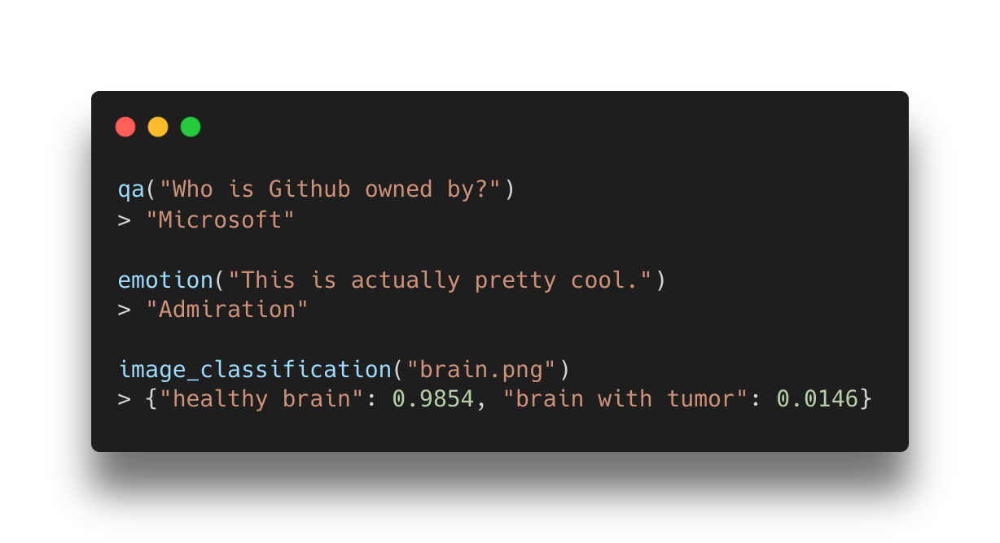

<h1 align="center">
   
</h1>

<p align="center">
   <a href="https://pypi.org/project/backprop/"></a>  <a href="https://www.apache.org/licenses/LICENSE-2.0"></a>
</p>

<p align="center">
Backprop makes it simple to use, finetune, and deploy state-of-the-art ML models.
</p>

<p align="center">
   
</p>

Solve a variety of tasks with pre-trained models or finetune them in one line for your own tasks.

Out of the box tasks you can solve with Backprop:

- Conversational question answering in English
- Text Classification in 100+ languages
- Image Classification
- Text Vectorisation in 50+ languages
- Image Vectorisation
- Summarisation in English
- Emotion detection in English
- Text Generation

For more specific use cases, you can adapt a task with little data and a single line of code via finetuning.

You can run all tasks and models on your own machine, or in production with our inference [API](https://backprop.co).

Your finetuned models can be deployed in one line of code.

| ⚡ [Getting started](#getting-started)                | Installation, few minute introduction             |
| :---------------------------------------------------- | :------------------------------------------------ |
| 💡 [Examples](#examples)                              | Finetuning and usage examples                     |
| 📙 [Docs](https://backprop.readthedocs.io/en/latest/) | In-depth documentation about our tasks and models |

## Getting started

### Installation

Install Backprop via PyPi:

```bash
pip install backprop
```

### Basic task solving

```python
from backprop import QA

context = "Take a look at the examples folder to see use cases!"

qa = QA()

# Start building!
answer = qa("Where can I see what to build?", context)

print(answer)
# Prints
"the examples folder"
```

### Basic finetuning and uploading

```python
from backprop.models import T5
from backprop import TextGeneration

tg = TextGeneration(T5)

# Any text works as training data
inp = ["I really liked the service I received!", "Meh, it was not impressive."]
out = ["positive", "negative"]

# Finetune with a single line of code
tg.finetune({"input_text": inp, "output_text": out})

# Use your trained model
prediction = tg("I enjoyed it!")

print(prediction)
# Prints
"positive"

# Upload to Backprop for production ready inference

model = tg.model
# Describe your model
model.name = "t5-sentiment"
model.description = "Predicts positive and negative sentiment"

backprop.upload(model, api_key="abc")
```

## Why Backprop?

1. No experience needed

   - Entrance to practical AI should be simple
   - Get state-of-the-art performance in your task without being an expert

2. Data is a bottleneck

   - Use AI without needing access to "big data"
   - With transfer learning, even a small amount of data can adapt a task to your niche requirements

3. There are an overwhelming amount of models

   - We implement the best open-source and make them simple to use
   - A few general models can accomplish more with less optimisation

4. Deploying models cost effectively is hard work
   - If our models suit your use case, no deployment is needed: just call our API
   - Adapt and deploy your own model with just a few lines of code
   - Our API scales, is always available, and you only pay for usage

## Examples

- Getting started with Finetuning ([Github](https://github.com/backprop-ai/backprop/blob/main/examples/Finetuning_GettingStarted.ipynb), [Colab](https://colab.research.google.com/github/backprop-ai/backprop/blob/main/examples/Finetuning_GettingStarted.ipynb))
- [Finetuning and task examples](https://github.com/backprop-ai/backprop/tree/main/examples)

## Documentation

Check out our [docs](https://backprop.readthedocs.io/en/latest/).

## Demos

Zero-shot image classification with [CLIP](https://clip.backprop.co).

## Feedback

Found a bug or have ideas for new tasks and models? Open an [issue](https://github.com/backprop-ai/backprop/issues).
