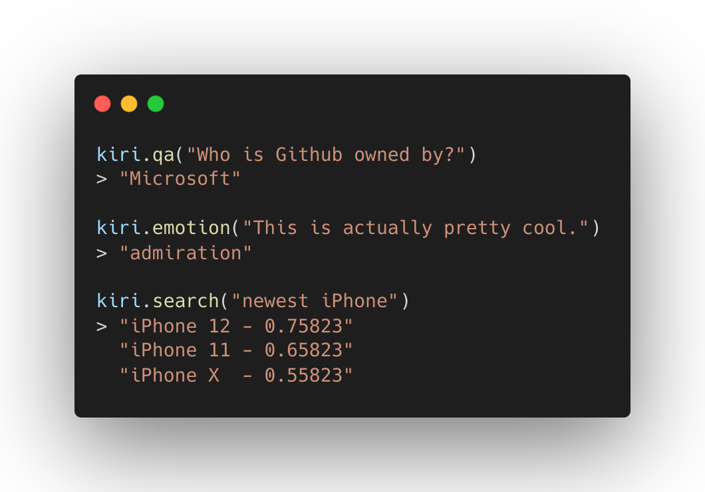

<h1 align="center">Backprop</h1>

<p align="center">
   <a href="https://pypi.org/project/kiri/"></a>  <a href="https://www.apache.org/licenses/LICENSE-2.0"></a>
</p>

<p align="center">
Kiri is a Python library that makes it simple to solve AI tasks without requiring any data.
</p>

Kiri is built around solving tasks with transfer learning. It implements state-of-the-art AI models that are general enough to solve real world tasks with no data required from the user.

<p align="center">
   
</p>

Out of the box tasks you can solve with Kiri:

- Conversational question answering in English (for FAQ chatbots, text analysis, etc.)
- Text Classification in 100+ languages (for email sorting, intent detection, etc.)
- Image Classification (for object recognition, OCR, etc.)
- Text Vectorisation in 50+ languages (semantic search for ecommerce, documentation, etc.)
- Summarisation in English (TLDRs for long documents)
- Emotion detection in English (for customer satisfaction, text analysis, etc.)
- Text Generation (for idea, story generation and broad task solving)

For more specific use cases, you can adapt a task with little data and a couple of lines of code using finetuning. We are adding finetuning support for all tasks soon.

You can run all tasks locally or in production with our optimised inference [API](https://kiri.ai), where you only pay for usage. It includes all the tasks, models in our library and lets you upload your own finetuned models.

| ⚡ [Getting started](#getting-started)                            | Installation, few minute introduction     |
| :---------------------------------------------------------------- | :---------------------------------------- |
| 💡 [Examples](https://github.com/kiri-ai/kiri/tree/main/examples) | Sample problems solved using Kiri         |
| 📙 [Docs](https://kiri.readthedocs.io/en/latest/)                 | In-depth documentation for advanced usage |

## Getting started

### Installation

Install Kiri via PyPi:

```bash
pip install kiri
```

### Basic task solving

```python
from kiri import Kiri

context = "Take a look at the examples folder to see use cases!"

# Use our inference API
k = Kiri(api_key="abc")
# Or run locally
k = Kiri(local=True)

# Start building!
answer = k.qa("Where can I see what to build?", context)

print(answer)
# Prints
"the examples folder"
```

### Basic finetuning and uploading

```python
from kiri.models import T5
from kiri.tasks import TextGeneration

tg = TextGeneration(T5, local=True)

# Any text works as training data
inp = ["I really liked the service I received!", "Meh, it was not impressive."]
out = ["positive", "negative"]

# Finetune with a single line of code
tg.finetune(inp, out)

# Use your trained model
prediction = tg("I enjoyed it!")

print(prediction)
# Prints
"positive"

# Upload to Kiri for production ready inference
import kiri

model = tg.model
# Describe your model
model.name = "t5-sentiment"
model.description = "Predicts positive and negative sentiment"

kiri.upload(model, api_key="abc")
```

## Why Kiri?

1. No experience needed

   - Entrance to practical AI should be simple
   - Get state-of-the-art performance in your task without being an expert

2. Data is a bottleneck

   - Use AI without needing access to "big data"
   - With transfer learning, no data is required, but even a small amount can adapt a task to your niche.

3. There is an overwhelming amount of models

   - We implement the best ones for various tasks
   - A few general models can accomplish more with less optimisation

4. Deploying models cost effectively is hard work
   - If our models suit your use case, no deployment is needed
   - Adapt and deploy your own model with a couple of lines of code
   - Our API scales, is always available, and you only pay for usage

## Examples

Take a look at the [examples folder](https://github.com/kiri-ai/kiri/tree/main/examples).

## Documentation

Check out our [docs](https://kiri.readthedocs.io/en/latest/).
